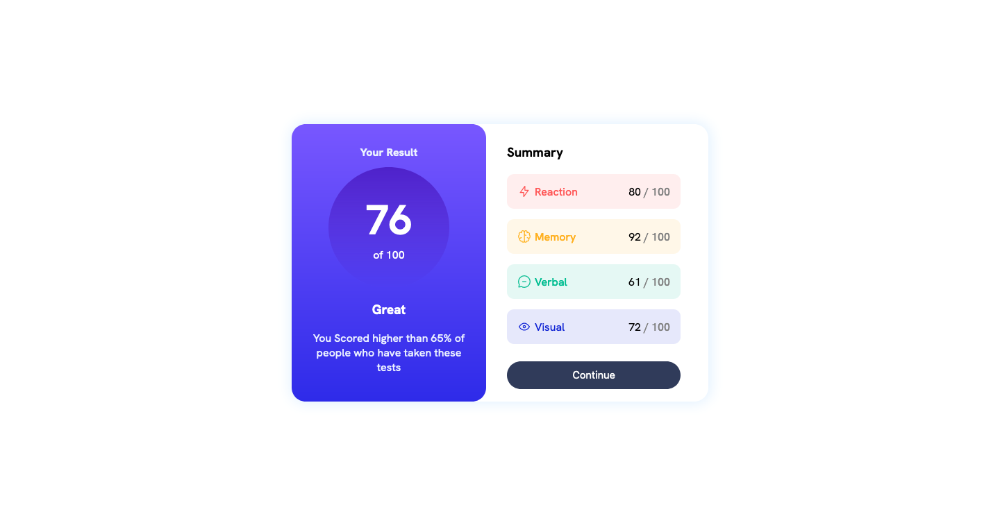

# Frontend Mentor - Results summary component solution

This is a solution to the [Results summary component challenge on Frontend Mentor](https://www.frontendmentor.io/challenges/results-summary-component-CE_K6s0maV). Frontend Mentor challenges help you improve your coding skills by building realistic projects. 

## Table of contents

- [Overview](#overview)
  - [The challenge](#the-challenge)
  - [Screenshot](#screenshot)
  - [Links](#links)
  - [Built with](#built-with)
  - [What I learned](#what-i-learned)
  - [Continued development](#continued-development)
- [Author](#author)

## Overview

### The challenge

Users should be able to:

- View the optimal layout for the interface depending on their device's screen size
- See hover and focus states for all interactive elements on the page

### Screenshot



### Links

- Solution URL: [Add solution URL here](https://your-solution-url.com)
- Live Site URL: [Add live site URL here](https://your-live-site-url.com)


### Built with

- Semantic HTML5 markup
- CSS custom properties
- Flexbox
- CSS Grid
- Desktop-first workflow

### What I learned

I learned how to use media queries to create a website that looks good on all screen sizes

```css
@media (max-width: 760px) {
  .container {
    width: 100%;
    height: 100%;
    flex-direction: column;
    border-radius: 0px;
    overflow: hidden;
    padding: 0;
  }

  .results {
    width: 100%;
    border-radius: 0px 0px 20px 20px;
    padding: 0;
    text-align: center;
  }

  .left-text{
     padding: 20px;
     text-align: center;
  }

  .summary {
    padding: 0;
    width: 80%;
    margin: 0 auto;
  }
}
```

### Continued development

I will like to focus more on devloping my skills in CSS grid and flexbox as well as Responsive Web Development


## Author

- Frontend Mentor - [@yourusername](https://www.frontendmentor.io/profile/yourusername)
- Twitter - [@thatbirdintech](https://www.twitter.com/thatbirdintech)

# Results-summary-component
